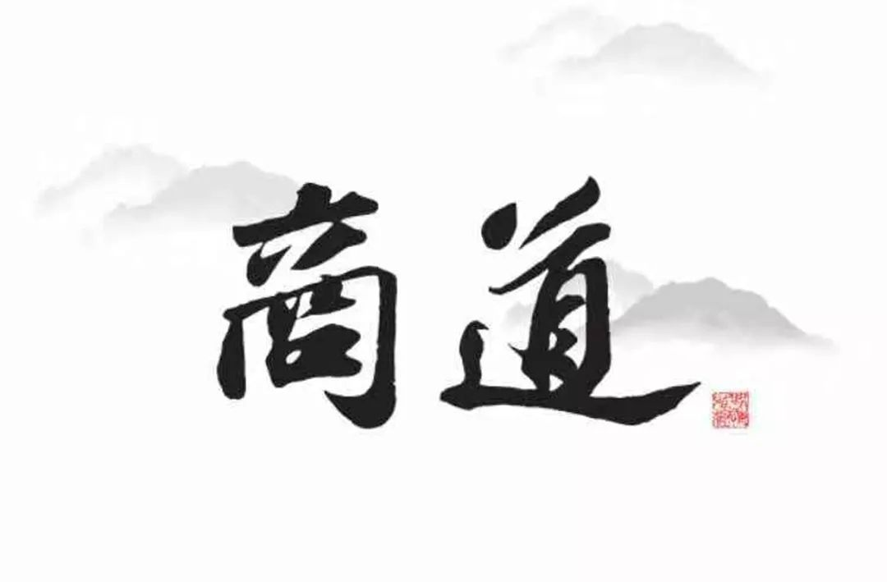

>---
>
>无财作力，少有斗智，既饶争时														---货殖列传
>
>---

---

《商道》以中国传统经济思想和中国传统商业观、财富观为基础，系统阐述为商之道。

主要体现了作者秀阳先生财富德富的全面财富观，事业家业的全面成就观，有所为有所不为的战略观，厚德载物的创造观，修身齐家治商的修身观，共存共荣的竞合观，共创共享的利益观，上下相怜的人才观，同时还体现出精益求精的工匠精神和基业长青的老字号精神，是从事商业活动的必修读本。

## 战略之道始

夫战略者，止也。《大学》云：“知止而后有定，定而后能静，静而后能安，安而后能虑，虑而后能得”。夫止者，知为，知不为也。

夫战略者，专一守恒也。毕其终生专注一业，人无不可以成就。常云：鱼与熊掌不可兼得，一心不可二用，逐二兔不得一兔，莫不劝人专一守恒。

夫战略之根本，寡欲也。夫寡欲者，盖因知所止而无欲于他也。

## 诚信之道二

夫诚信，人之本也，商之本也。孔子曰：“人而无信，不知其可也”。孟子曰：“诚者天之道也；思诚者人之道也”。古今商贾名号，莫不以诚信为本。

夫商者，久耕于一方一行，四里八乡群众，天南海北业内，莫无不知，苟不诚信，唯利是图，人皆避而远之。荀子曰：“言无常信，行无常贞，惟利所在，无所不倾，若是则可谓小人矣”。

夫诚者，诚心正意也，心之所诚，意之所正，行之所端。夫信者，信任确认也，人情之信任，事情之确认也。

## 财富之道三

财富者，非钱财而已矣。古云五福，曰长寿，曰富贵，曰康宁，曰好德，曰善终是也。夫长寿者，命不夭折且寿数绵长是为长，死而不亡者谓之寿；夫富贵者，财物足用且知足者谓之富，自尊且受人敬者谓之贵；夫康宁者，体健谓之康，心安谓之宁；夫好德者，仁而乐善也；夫善终者，无疾无痛无愧无悔而终，且饰终以礼也。夫善终者，更曰至善圆满。

而世之凡夫常以钱财多寡而论富，实短见也。家财万贯而身心穷困者，位高权重而令人不齿者，吾见众也。

商圣--范蠡

## 健康之道四

人之创造，莫不藉由身之所用。健康之身，业之青山也。身在一切在，身无一切无。而世人为欲所驱而奋不顾身者众，或英年早逝，或不得长寿善终者比比皆是，而人犹未能警而惕之。愚也。

夫事无限而生有限，以有限而逐无限，歹也。奋力虽疾，然身受损，寿数缩短，以寿数换事业，吾不能说其奋也，智也。循序虽缓，然身保也，寿命长也，以增长之寿补循序之缓，吾不能说其怠也、愚也。

夫健康者，养生也，养生者，食睡心也，而以养心为本。心悦食足，心静睡安，心定气足。养心在养欲。

## 生财之道五

生财之道，在《大学》：“生之者众，食之者寡，为之者疾，用之者舒，则财恒足矣”。又曰：“仁者以财发身，不仁者以身发财”。

生财之道，在勤俭致富。富而不据，乐善好施，据之为粮，施之为种，愈施愈生，愈生愈有。

生财之道，在君子之行。君子富而无骄，君子富而好礼。太史公曰：君子富，好行其德。

## 利益之道六

君子爱财，取之有道。不义之财如流水，不义之财为祸害。孔子曰：“不义而富且贵于我如浮云”。又曰：“君子喻于义，小人喻于利”。

恒心恒志恒业为恒利久利，斯为大利；唯利是图，斯为小利；投机取巧，斯为短利；见利忘义，斯为恶利。

儒商鼻祖--子贡

## 竞合之道七

竞者竞也，你争我赶，互奋也。合者和也，和气生财，共赢也。管子曰：“善气迎人，亲如弟兄；恶气迎人，害于戈兵”。

夫竞合之道，竞而不争，竞而相合，君子之竞也。

## 行销之道八

行销之道，道术器用。道者本也，精益求精，见者莫不赞叹，莫不追求，真金不怕红炉火，酒香不怕巷子深是也。术者法也，想方设法，与人消息，与人共鸣，人皆慕名而来也。器者器也，与行销之方便也。用者复也，反反复复，熟能生巧，绝招是也。

## 齐家之道九

治商之道，首在齐家。家不齐而业不成。齐家者，使家和也，家和万事兴，家不和万世贫。古今之大商名贾，莫不齐家有方。

业之有成者二，一为事业所成，二为齐家所成。夫若事业有成而齐家有失，终家毁业亡也。

齐家之要，在教子之道，教子之道，上行下效。孔子曰：“其身正，不令而行，其身不正，虽令不从”。此齐家之本在父母之修，不修身不可以齐家。

商祖--白圭

## 修身之道十

《大学》云：“自天子以至于庶人，壹是皆以修身为本”。夫为商者，亦以修身为本，修身齐家治商平天下。修己方可安人，不修身不可以齐家治商。

夫修身者也，非修人也，修己也。孟子曰：“爱人不亲，反其仁；治人不治，反其智；礼人不答，反其敬，行有不得者皆反求诸己，其身正而天下归之。诗云：‘永言配命，自求多福。’”。

夫修身者，小修结小人，谋小利，为小商；中修结中人，谋中利，为中商；大修结上人，谋大利，为大商。

## 孝敬之道十一

修身之道，首在孝道。孔子曰：“夫孝，德之本也，教之所由生也”。孔子曰：“夫孝者，天之经也，地之义也，民之行也”。

吾未见不孝而能利他者，亦未见不能利他者而能利己者。夫能孝则能爱人，能爱人则爱返，万事如意。不能孝则不能爱人，不能爱人则爱无返，诸事不顺也。

孔子曰：“孝悌之至，通于神明，光于四海，无所不通”。此孝能载物，孝能治业也。小孝治小业小富，中孝治中业中富，大孝治大业大富，不孝无业不富。

## 交友之道十二

交友之道，贵以诚心交益友。古云：以利相交，利尽则散；以势相交，势败则倾；以权相交，权失则弃；以情相交，情断则伤；唯以诚心相交，方能成其久远。

孔子曰：“益者三友，损者三友。友直，友谅，友多闻，益矣。友便辟，友善柔，友便佞，损矣”。

经济祖师--管仲

## 人才之道十三

孔子曰：“君君臣臣，父父子子”。君仁而臣忠，父慈而子孝。爱人者，人莫不感恩图报，恒心勇为。

孟子曰：“民为贵，社稷次之，君为轻”。又曰：“乐民之乐者，民亦乐其乐；忧民之忧者，民亦忧其忧。乐以天下，忧以天下，然而不王者，未之有也”。

孟子曰：“有恒产者有恒心，无恒产者无恒心，苟无恒心，放僻邪侈，无不为已”。《大学》云：“德者本也，财者末也。外本内末，争民施夺。是故财聚则民散，财散则民聚。”

## 继承之道十四

继承之道，在德不在财，在事不在业。若后人无德行则财尽，无事事则业亡。继承之道，在有所事事，有所好德。事事而乐业，乐业之人必有福报；好德而积善，积善之家必有余庆。

## 大商之道末

凡人者，相中迷，念中控，欲中奴，不了凡不能为大商也。古今之大商，莫不开悟明道，内圣外王，为天下治理财富而小心翼翼，慈善为民而简约朴素。陶朱公范蠡，世人称财神，财三聚三散，忠以为国，智以保身，商以致富，成名天下，为大商之范。

## 相关阅读

- [货殖列传](https://www.zhihu.com/topic/19894797/hot)
- [货殖列传--无财作力，少有斗智，既饶争时](https://xueqiu.com/7077207893/145417713)
- [参考1](http://www.pinlue.com/article/2019/03/2311/448341821259.html)
- [参考2](https://www.sohu.com/a/271560360_740471)
- [参考3](https://www.sohu.com/a/278498105_100008865)
- 其他解读

